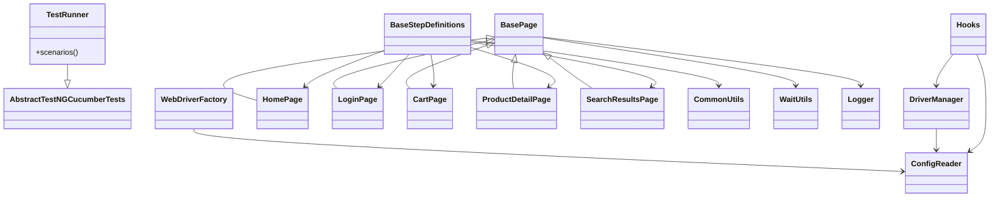

# Değişiklik Özeti / Summary of Changes

(TR) Bu dosya, projenin mimari analizi, ana sınıfları, OOP ilişkileri, kod kokuları, iyileştirme önerileri, raporlama ve Selenoid tabanlı video kayıt altyapısı dahil olmak üzere kapsamlı bir QA denetim raporudur. Ayrıca, Selenoid ve video kayıt desteği için gerekli ek dosyalar ve komutlar önerilmiştir.

(EN) This file is a comprehensive QA audit report including architecture analysis, main classes, OOP relationships, code smells, improvement suggestions, reporting and Selenoid-based video recording setup. It also proposes additional files and commands for Selenoid and video recording support.

---

# İçindekiler / Table of Contents
- [Proje Özeti / Project Summary](#proje-özeti--project-summary)
- [Ana Sınıflar Tablosu / Main Classes Table](#ana-sınıflar-tablosu--main-classes-table)
- [İlişkiler ve OOP Yapısı / Relationships & OOP](#ilişkiler-ve-oop-yapısı--relationships--oop)
- [Kod Kokuları ve Riskler / Code Smells & Risks](#kod-kokuları-ve-riskler--code-smells--risks)
- [İyileştirme Önerileri / Improvements](#iyileştirme-önerileri--improvements)
- [Çalıştırma & Raporlama / Run & Reporting](#çalıştırma--raporlama--run--reporting)
- [Video Kaydı Altyapısı / Video Recording Setup](#video-kaydı-altyapısı--video-recording-setup)

---

# Proje Özeti / Project Summary

(TR)
- **Teknoloji Yığını:** Java 11, Selenium 4.25.0, Cucumber 7.15.0, TestNG 7.8.0, WebDriverManager 5.6.2, Allure 2.24.0, Log4j 2.22.0
- **Build Aracı:** Maven (`pom.xml`)
- **Test Koşumu:** `mvn clean test -DsuiteXmlFile=testng.xml -Denv=local`
- **Test Senaryoları:** `src/test/resources/features/*.feature` dosyalarında, tag bazlı (@smoke, @regression, @macbook, vb.)
- **Raporlar:** `target/cucumber-html-report.html`, `target/cucumber-json-report.json`, `target/cucumber-xml-report.xml`, Allure (`allure serve target/allure-results`)
- **Konfig Dosyası:** `src/test/resources/config/config.properties`

(EN)
- **Tech Stack:** Java 11, Selenium 4.25.0, Cucumber 7.15.0, TestNG 7.8.0, WebDriverManager 5.6.2, Allure 2.24.0, Log4j 2.22.0
- **Build Tool:** Maven (`pom.xml`)
- **Test Execution:** `mvn clean test -DsuiteXmlFile=testng.xml -Denv=local`
- **Test Scenarios:** In `src/test/resources/features/*.feature`, tag-based (@smoke, @regression, @macbook, etc.)
- **Reports:** `target/cucumber-html-report.html`, `target/cucumber-json-report.json`, `target/cucumber-xml-report.xml`, Allure (`allure serve target/allure-results`)
- **Config File:** `src/test/resources/config/config.properties`

---

# Ana Sınıflar Tablosu / Main Classes Table

| Sınıf Adı / Class Name | Sorumluluk / Responsibility | Önemli Metodlar / Key Methods | Katman / Layer | Bağımlılıklar / Dependencies |
|-----------------------|-----------------------------|------------------------------|---------------|-----------------------------|
| TestRunner            | Cucumber+TestNG koşucu      | scenarios()                  | Runner        | AbstractTestNGCucumberTests, CucumberOptions |
| Hooks                 | Test setup/teardown         | setUp(), tearDown()          | Hooks         | DriverManager, ConfigReader, Logger |
| BaseStepDefinitions   | Adım tanımları              | step methods                 | StepDefs      | Page Objects, Utils         |
| WebStepDefinitions    | Web adım tanımları          | step methods                 | StepDefs      | Page Objects, Utils         |
| AmazonStepDefinitions | Amazon spesifik adımlar      | step methods                 | StepDefs      | Page Objects, Utils         |
| BasePage              | Ortak POM işlevselliği      | waitForElementToBeVisible()  | PageObject    | WebDriver, WaitUtils, Logger, PageFactory |
| HomePage, LoginPage, CartPage, ProductDetailPage, SearchResultsPage | Sayfa işlemleri | page actions, validations    | PageObject    | BasePage, WebDriver         |
| CommonUtils           | Genel yardımcılar            | utility methods              | Utils         | -                           |
| ScreenshotUtils       | Ekran görüntüsü alma         | takeScreenshot()             | Utils         | WebDriver                   |
| WaitUtils             | Selenium bekleme yardımcıları| waitForElementToBeVisible()  | Utils         | WebDriver, WebDriverWait    |
| DriverManager         | WebDriver yaşam döngüsü      | initializeDriver()           | Drivers       | ConfigReader, WebDriver     |
| WebDriverFactory      | WebDriver oluşturucu         | createDriver()               | Drivers       | ConfigReader, WebDriverManager |
| ConfigReader          | Konfig okuma                 | getProperty(), getBrowser()  | Config        | Properties                  |

(EN)
| Class Name            | Responsibility              | Key Methods                  | Layer         | Dependencies                |
|-----------------------|-----------------------------|------------------------------|---------------|-----------------------------|
| TestRunner            | Cucumber+TestNG runner      | scenarios()                  | Runner        | AbstractTestNGCucumberTests, CucumberOptions |
| Hooks                 | Test setup/teardown         | setUp(), tearDown()          | Hooks         | DriverManager, ConfigReader, Logger |
| BaseStepDefinitions   | Step definitions            | step methods                 | StepDefs      | Page Objects, Utils         |
| WebStepDefinitions    | Web step definitions        | step methods                 | StepDefs      | Page Objects, Utils         |
| AmazonStepDefinitions | Amazon-specific steps        | step methods                 | StepDefs      | Page Objects, Utils         |
| BasePage              | Common POM functionality    | waitForElementToBeVisible()  | PageObject    | WebDriver, WaitUtils, Logger, PageFactory |
| HomePage, LoginPage, CartPage, ProductDetailPage, SearchResultsPage | Page actions | page actions, validations    | PageObject    | BasePage, WebDriver         |
| CommonUtils           | General utilities           | utility methods              | Utils         | -                           |
| ScreenshotUtils       | Screenshot utility          | takeScreenshot()             | Utils         | WebDriver                   |
| WaitUtils             | Selenium wait utilities     | waitForElementToBeVisible()  | Utils         | WebDriver, WebDriverWait    |
| DriverManager         | WebDriver lifecycle         | initializeDriver()           | Drivers       | ConfigReader, WebDriver     |
| WebDriverFactory      | WebDriver factory           | createDriver()               | Drivers       | ConfigReader, WebDriverManager |
| ConfigReader          | Config reader               | getProperty(), getBrowser()  | Config        | Properties                  |

---

# İlişkiler ve OOP Yapısı / Relationships & OOP

(TR)
- **Kalıtım:** Tüm sayfa nesneleri `BasePage`'den türemiştir. `TestRunner`, `AbstractTestNGCucumberTests`'ı genişletir.
- **Kompozisyon:** StepDefinitions sınıfları Page Object ve Utils sınıflarını kullanır.
- **Arayüz Kullanımı:** Selenium WebDriver API ve Cucumber arayüzleri kullanılır.
- **SOLID Analizi:**
  - S: Sınıflar tek sorumluluk ilkesine çoğunlukla uygun.
  - O: Yeni sayfa/step eklemek kolay, mevcut kodu bozmadan genişletilebilir.
  - L: Tüm alt sınıflar üst sınıfın davranışını bozmadan kullanılabilir.
  - I: Test bağımlılıkları küçük parçalara ayrılmış.
  - D: WebDriver ve ConfigReader gibi bağımlılıklar soyutlanmış.

(EN)
- **Inheritance:** All page objects inherit from `BasePage`. `TestRunner` extends `AbstractTestNGCucumberTests`.
- **Composition:** StepDefinitions use Page Object and Utils classes.
- **Interface Usage:** Selenium WebDriver API and Cucumber interfaces are used.
- **SOLID Analysis:**
  - S: Classes mostly follow single responsibility.
  - O: Easy to add new pages/steps without breaking existing code.
  - L: Subclasses can be used in place of parents.
  - I: Test dependencies are split into small pieces.
  - D: WebDriver and ConfigReader are abstracted.

---

# Kod Kokuları ve Riskler / Code Smells & Risks

(TR)
- God class riski: `WaitUtils` ve bazı PageObject'ler çok fazla yardımcı fonksiyon içeriyor olabilir.
- Tekrarlı locator'lar: Locator'lar merkezi yönetilmiyor, değişiklikte bakım maliyeti artar.
- Flaky waits: Zaman ayarlı beklemeler yerine koşula dayalı bekleme önerilir.
- Hard-coded config: Bazı ayarlar doğrudan kodda olabilir.
- PageFactory güncelliği: Modern Selenium'da PageFactory yerine lambda/By kullanımı önerilir.

(EN)
- God class risk: `WaitUtils` and some PageObjects may have too many helpers.
- Duplicate locators: Locators are not centrally managed, increasing maintenance cost.
- Flaky waits: Prefer condition-based waits over fixed sleeps.
- Hard-coded config: Some settings may be hardcoded.
- PageFactory usage: Consider replacing with By/lambda in modern Selenium.

---

# İyileştirme Önerileri / Improvements

(TR)
## Quick Wins
- Locator'ları merkezi bir `Locators.java` dosyasında topla.
- Beklemeleri sadece koşula dayalı hale getir.
- PageFactory yerine modern By/lambda kullanımı.

## Orta Vadeli
- Ortak step'leri yeniden kullanılabilir hale getir.
- ConfigReader'ı environment bazlı dinamik yap.
- Test paralelizmini arttırmak için DataProvider'ı paralel yap.

## Mimarî Revizyonlar
- Tüm driver yönetimini tek bir factory class'a taşı.
- Allure/Extent raporlamasını zorunlu kıl.
- Selenoid ile video kaydı desteği ekle.

(EN)
## Quick Wins
- Centralize locators in a `Locators.java` file.
- Use only condition-based waits.
- Replace PageFactory with By/lambda usage.

## Mid-term
- Make common steps reusable.
- Make ConfigReader dynamic per environment.
- Enable parallel DataProvider for more speed.

## Architectural
- Move all driver management to a single factory.
- Enforce Allure/Extent reporting.
- Add Selenoid video recording support.

---

# Çalıştırma & Raporlama / Run & Reporting

(TR)
- Testleri çalıştır: `mvn clean test -DsuiteXmlFile=testng.xml -Denv=local`
- Allure raporu: `allure serve target/allure-results`
- Cucumber HTML/JSON raporu: `target/cucumber-html-report.html`, `target/cucumber-json-report.json`
- Paralel koşum: TestNG `thread-count` ve Cucumber `@DataProvider(parallel = true)` ile
- Tag stratejisi: @smoke, @regression, @macbook, @priority-high, @wip, @ignore

(EN)
- Run tests: `mvn clean test -DsuiteXmlFile=testng.xml -Denv=local`
- Allure report: `allure serve target/allure-results`
- Cucumber HTML/JSON reports: `target/cucumber-html-report.html`, `target/cucumber-json-report.json`
- Parallel: TestNG `thread-count` and Cucumber `@DataProvider(parallel = true)`
- Tag strategy: @smoke, @regression, @macbook, @priority-high, @wip, @ignore

---

# Video Kaydı Altyapısı / Video Recording Setup

(TR)
- Selenoid için aşağıdaki dosyaları oluşturun:
  - `docker-compose.selenoid.yml`
  - `browsers.json`
  - `scripts/selenoid-start.sh`, `scripts/selenoid-stop.sh`
- `SELENOID_URL` env değişkenini kullanarak RemoteWebDriver başlatın.
- `mvn -Pvideo test` ile video çıktıları `artifacts/videos/` altında oluşur.
- Selenoid yoksa, local fallback: asciinema veya OS-level screen recorder.

(EN)
- For Selenoid, create:
  - `docker-compose.selenoid.yml`
  - `browsers.json`
  - `scripts/selenoid-start.sh`, `scripts/selenoid-stop.sh`
- Use `SELENOID_URL` env variable to launch RemoteWebDriver.
- With `mvn -Pvideo test`, videos are under `artifacts/videos/`.
- If Selenoid unavailable, fallback: asciinema or OS-level recorder.

---

## Varsayım / Assumption
- (TR) Video ve Selenoid entegrasyonu için gerekli dosyalar henüz mevcut değildir ve eklenmesi gerekmektedir.
- (EN) Files for video and Selenoid integration are assumed missing and need to be added.

---

> (TR) Devamında Selenoid ve video desteği için örnek dosyalar ve patch’ler önerilecektir.
> (EN) Example files and patches for Selenoid/video support will be proposed next.
